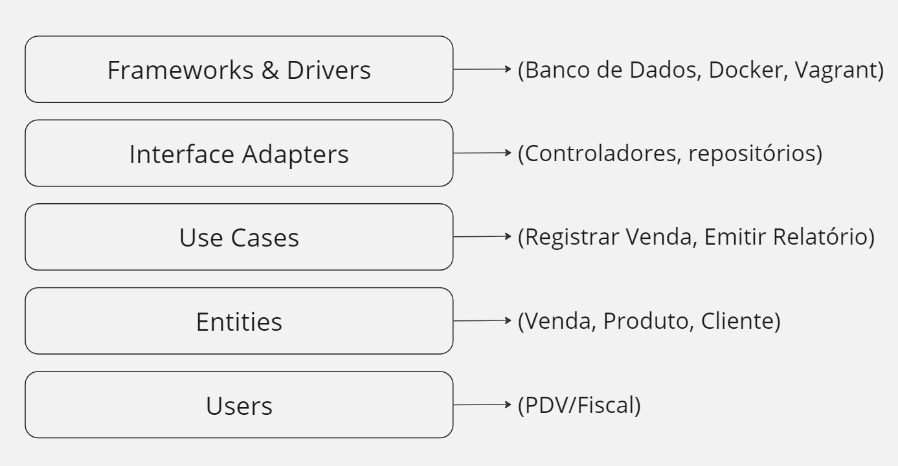

# Documentação de Arquitetura - SuperCaixa AI

O **SuperCaixa AI** é um sistema de PDV (Ponto de Venda) para supermercados, projetado para ser escalável, modular e fácil de manter. Utilizamos uma combinação de **Clean Architecture** e outros princípios modernos de design de software para garantir que o sistema seja flexível, seguro e performático.

## Princípios de Arquitetura

### Diagrama da Arquitetura

O diagrama abaixo representa a estrutura da Clean Architecture aplicada ao SuperCaixa AI:

### 1. **Clean Architecture**
- A **Clean Architecture** é o coração do design do SuperCaixa AI. Ela separa o sistema em camadas, garantindo que a lógica de negócio (Entidades e Casos de Uso) seja independente de detalhes de implementação (como banco de dados, interfaces de usuário e frameworks).
  
  **Camadas**:
  - **Entidades**: As regras de negócio fundamentais, como Produtos e Vendas.
  - **Casos de Uso**: A lógica de aplicação, como Registrar Vendas e Emitir Relatórios.
  - **Adaptadores de Interface**: Pontes entre a lógica de negócio e as interfaces externas (bancos de dados, APIs, etc.).
  - **Infraestrutura**: Frameworks, bancos de dados e ferramentas externas, desacoplados das camadas centrais.

### 2. **SOLID**
- **S**: **Responsabilidade Única**: Cada classe ou módulo tem uma única responsabilidade no sistema.
- **O**: **Aberto/Fechado**: O código está aberto para extensão, mas fechado para modificação, garantindo que novos comportamentos possam ser adicionados sem alterar o que já existe.
- **L**: **Substituição de Liskov**: As subclasses podem substituir as classes base sem alterar a funcionalidade.
- **I**: **Segregação de Interfaces**: Criamos interfaces específicas, garantindo que as classes implementem apenas o que precisam.
- **D**: **Inversão de Dependência**: Módulos de alto nível não dependem de módulos de baixo nível, ambos dependem de abstrações (interfaces).

### 3. **TDD (Test-Driven Development)**
- O **TDD** será aplicado para garantir a qualidade e funcionalidade desde o início. Escrevemos testes antes de implementar cada funcionalidade.
- **Exemplo**: Para o caso de uso "Registrar Venda", primeiro criamos testes que validam o comportamento esperado e, depois, implementamos o código para passar nesses testes.

### 4. **DDD (Domain-Driven Design)**
- Utilizamos **DDD** para alinhar o código com o domínio do negócio de supermercados. Dividimos o sistema em subdomínios como:
  - **Gestão de Vendas**
  - **Controle de Estoque**
  - **Relatórios de Desempenho**
- Cada subdomínio tem suas próprias entidades e regras de negócio, e usamos uma linguagem ubíqua (termos comuns e consistentes) para facilitar a comunicação entre desenvolvedores e gestores do supermercado.

### 5. **CQRS (Command Query Responsibility Segregation)**
- No **SuperCaixa AI**, separamos a lógica de **Comando** e **Consulta**. 
  - **Comandos**: Manipulam dados e alteram o estado do sistema (ex.: Registrar Venda, Atualizar Estoque).
  - **Consultas**: Fazem leituras do estado sem modificar nada (ex.: Gerar Relatório de Vendas).
- Isso permite otimizações e separa as preocupações de leitura e escrita, tornando o sistema mais eficiente e organizado.

### 6. **Infraestrutura como Código (IaC)**
- Toda a infraestrutura do **SuperCaixa AI** será definida como código, utilizando ferramentas como:
  - **Vagrant** (para o desenvolvimento inicial)
  - **Docker** e **Terraform** (para futuras expansões)
  - **Ansible** (para automação de provisionamento)
- A infraestrutura será gerenciada de forma automatizada, garantindo consistência em todos os ambientes (desenvolvimento, staging, produção).

### 7. **DevOps e CI/CD**
- Implementamos pipelines de **CI/CD** para garantir que a integração e entrega contínuas sejam ágeis e seguras.
- Usamos ferramentas como **GitHub Actions** ou **Jenkins** para executar testes automatizados e realizar deploys com confiança.
- O monitoramento será feito com ferramentas como **Prometheus** e **Grafana**, enquanto o log de erros e eventos será tratado com o **ELK Stack**.

## Exemplo de Aplicação dos Princípios

### Caso de Uso: Registrar Venda

1. **Entidades**:
   - **Produto**: Representa os produtos vendidos.
   - **Venda**: Contém a lista de produtos, valor total e outras informações da transação.

2. **Caso de Uso**:
   - O **Registrar Venda** é responsável por validar e processar a venda, garantindo que os dados estejam corretos e que o estoque seja atualizado.

3. **Adaptadores**:
   - O adaptador do **Banco de Dados** realiza a persistência das vendas e atualiza o estoque.

4. **Infraestrutura**:
   - A operação é armazenada em um banco de dados **MariaDB** ou **NoSQL**, e os dados podem ser acessados por meio de **APIs REST**.

## Vantagens da Arquitetura
- **Modularidade**: Cada componente é independente, facilitando a adição de novas funcionalidades.
- **Facilidade de Testes**: A aplicação do TDD e dos princípios SOLID garante que o sistema seja altamente testável.
- **Escalabilidade**: A separação de responsabilidades e o uso de CQRS permite que o sistema escale facilmente, especialmente em ambientes com alto volume de leitura e escrita.
- **Facilidade de Manutenção**: A Clean Architecture e o DDD mantêm o sistema organizado, facilitando a manutenção e evolução ao longo do tempo.

---

### Próximos Passos:
- Implementar os primeiros casos de uso, como **Registrar Venda**.
- Garantir que as práticas de **TDD** e os princípios **SOLID** sejam aplicados desde o início do desenvolvimento.
- Começar a testar o uso de containers Docker para a infraestrutura e fazer uma transição gradual do Vagrant.

---

Essa documentação deve fornecer uma visão clara e objetiva de como a arquitetura do **SuperCaixa AI** é organizada e os princípios que sustentam o design do sistema. Ela pode ser facilmente incluída no GitHub para os usuários e desenvolvedores terem uma boa compreensão da base do projeto.

Se precisar ajustar ou adicionar mais algum detalhe, é só avisar!